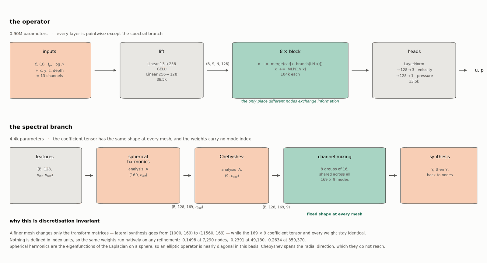
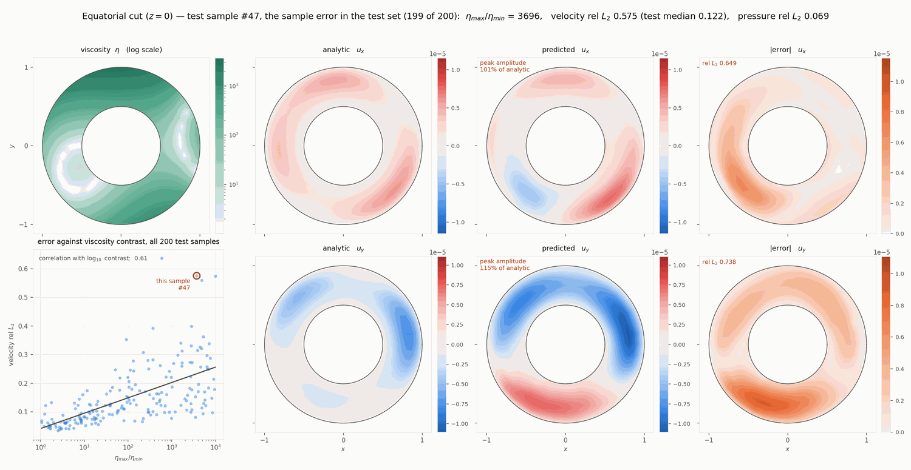

# terra-ml

A neural operator that learns the Stokes solution map on the TERRA-NG spherical shell,
together with the data generation it trains on and the solver-side hook that calls it.

    (f_u, f_p, eta)  ->  (u, p)

* `terra_data` — manufactured Stokes problems. Random polynomial solutions with the
  right-hand sides derived analytically in sympy against *the same* deviatoric operator
  TERRA implements, verified to reproduce the code's own analytic test cases with
  symbolically zero difference.
* `terra_infer` — the operator, its training driver, the finite-difference Stokes
  residual used as a physics loss, and the mesh symmetry group used for augmentation.

## Install

    pip install -e python/

This puts `terra_data` and `terra_infer` on the path for the batch scripts and for the
embedded interpreter in `terra::ml::NeuralSolver`.

## The spectral operator

The model is a stack of pointwise layers coupled by a **spectral branch**, and every
component is either pointwise or acts on a fixed set of modes:

    lift  Linear(13 -> 256) -> GELU -> Linear(256 -> 128)        pointwise
    8 x   x = x + merge(cat[x, branch(LayerNorm(x))])
          x = x + MLP(LayerNorm(x))                              pointwise
    head  LayerNorm -> {Linear(128->128)->GELU->Linear(128->3),  pointwise
                        Linear(128->128)->GELU->Linear(128->1)}

The 13 lift inputs are the momentum right-hand side (3), the continuity right-hand side,
log viscosity, and four geometry channels (Cartesian position and normalised depth), plus
optional derived channels `grad log eta` and `div f_u`.

Inside the branch, the field is transformed to a basis in which an elliptic operator is
nearly diagonal — spherical harmonics are the eigenfunctions of the Laplacian on a sphere:

    (B, 128, n_lat, n_rad)
      -> spherical-harmonic analysis   (lateral)      (B, 128, 169, n_rad)
      -> Chebyshev analysis            (radial)       (B, 128, 169, 9)
      -> block-diagonal channel mixing, 8 groups of 16, shared across modes
      -> synthesis back                               (B, 128, n_lat, n_rad)

Analysis uses the pseudo-inverse of the basis rather than a quadrature rule, because
nodes shared between diamonds are stored once per subdomain and a quadrature would
double-count the seams. Both transforms are exact for band-limited fields (verified to
5e-8 laterally and 1.6e-8 radially). The shell is an exact radial extrusion, so one
lateral transform serves every radial shell.

### Why it is discretisation invariant

The mixing weights carry **no mode index**, and the mode count is fixed by the basis
truncation rather than by the mesh. Refining the grid changes the transform matrices —
lateral synthesis goes from (1000, 169) to (11560, 169) — while every weight and the
(169 x 9) coefficient tensor stay the same. Nothing in the model is defined in index
units, so the same weights run natively on any refinement:

| mesh | velocity nodes | relative L2 |
|---|---|---|
| level 3 (trained here) | 7,290 | 0.1498 |
| level 4 | 49,130 | 0.2391 |
| level 5 | 359,370 | 0.2634 |

The error rises 1.76x over 49x the node count and then flattens. 0.90M parameters.

## Pipeline

### 1. Generate a dataset

Dump the mesh, then build the samples. Both are per-level; generation shards trivially.

    mpirun -np 1 ./stokes_dataset_tool --max-level 3 --min-level 2 --outdir $DIR
    python -m terra_data.generate --dir $DIR --num-train 1000 --num-test 200 \
        --max-degree 4 --contrast-min 1 --contrast-max 1e4 --seed 42 \
        --shard $i --num-shards 16

Samples are seeded per index, so sample *i* is the same analytic function at every
resolution — which is what makes cross-level comparison meaningful. Each sample is
normalised so `rms(f_u) = 1`; `u` and `p` scale with it, leaving the physics exact.

Datasets are large and regenerable — put them in an hpc-workspace, not in `$HOME`.

To check the generator against TERRA itself:

    python -c "from terra_data.stokes_symbolic import validate_against_terra_testcase as v; v()"
    python -c "from terra_infer.stokes_residual import validate; validate()"

### 2. Train

    python -m terra_infer.train_wavelet3d --data $DIR --epochs 720 \
        --no-wavelet --spherical 12 --radial-modes 8 \
        --symmetry-aug --physics-weight 2 --fine-continuity \
        --grad-log-eta --div-fu --mean-free-target --head-mlp \
        --mean-p-weight 1.0 --momentum-margin 2 --hidden 128 --layers 8

The loss is a relative L2 on velocity and mean-free pressure, plus the **Stokes residual**
evaluated by finite differences on the real mesh with its inverse Jacobian:
`||A u + grad p - f_u|| / ||f_u||` and `||div u - f_p|| / ||f_p||`, both on interior nodes.
Being relative makes every term scale-free, so they compose without unit tuning.

`--symmetry-aug` applies a random element of the mesh's exact symmetry group — the five
2*pi/5 polar rotations, which permute nodes with zero interpolation error, times the sign
flip that linearity provides. Worth -32% at a matched epoch budget, and free.

### 3. Test

    python -m terra_infer.train_wavelet3d --data $DIR --eval-only model.pt \
        --no-wavelet --spherical 12 --radial-modes 8 --hidden 128 --layers 8 \
        [--tta] [--dump-predictions preds.npz]

reports velocity and pressure relative L2, the momentum and continuity residuals, and the
error on the no-slip boundary. `--tta` averages the prediction over the whole symmetry
group, mapping each element back before averaging.

Note the momentum residual has a floor: the finite-difference operator applied to the
*true* fields scores 0.058, so values below that measure discretisation, not accuracy.

### 4. Run it on a finer mesh

Nothing needs retraining. Point the model at the other mesh and evaluate:

    from terra_infer.wavelet3d import Model, load_state
    net = Model(9, 4, (9, 9, 9), n_hidden=128, n_layers=8, coords=coarse_coords,
                head_mlp=True, spherical=12, radial_modes=8, wavelet=False)
    load_state(net, torch.load("model.pt")["model"])
    net.set_mesh((33, 33, 33), fine_coords)      # rebuilds the transforms, keeps weights
    u_p = net(fields)                            # (S, 33, 33, 33, 4)

### 5. Call it from the solver

Build with `-DTERRA_ENABLE_PYTHON=ON` and use `terra::ml::NeuralSolver`, which satisfies
`SolverLike`. Fields cross into Python zero-copy through the buffer protocol, and the
prediction is made consistent across subdomains before it is returned. Reachable from the
test driver as `test_epsilon_divdiv_stokes --neural-solver <model>`.

## Predictions

Equatorial cut on the easiest and hardest test samples. Analytic and predicted share a
colour scale per component, so amplitude damping stays visible; the error panel uses the
same scale again, so a faint panel means a genuinely small error.

Easiest, sample #74 — viscosity contrast 1.6, relative L2 0.051:

Hardest, sample #47 — contrast 3696, relative L2 0.575:

Viscosity contrast is the dominant remaining difficulty: error correlates with it at 0.61
across the test set, and concentrates in the low-viscosity channels — within sample #47,
0.80 in the softest viscosity decile against 0.27 in the stiffest.
